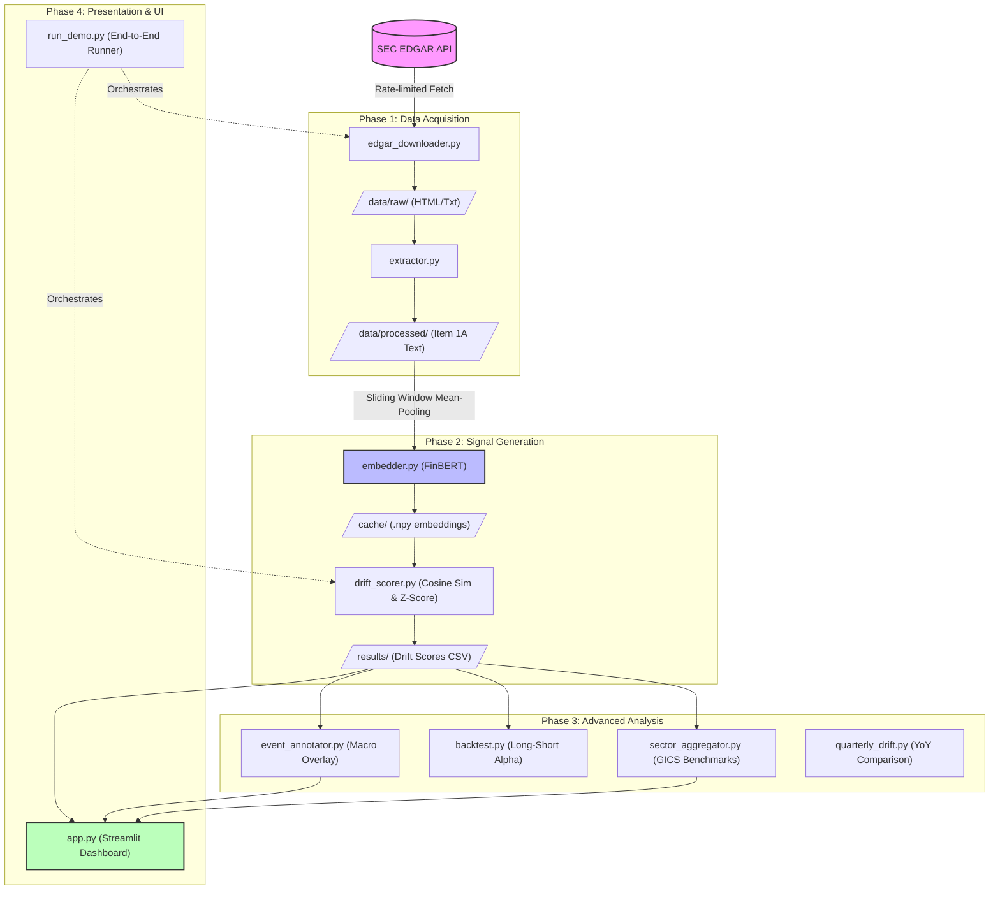

# RiskDrift: System Architecture Diagram

This diagram visualizes the end-to-end data flow and component relationships within the RiskDrift pipeline. It is ideal for inclusion in your presentation slides to show technical rigor.

### Component Narrative:
*   **The Pipeline (Top to Bottom):** Data flows linearly from the SEC down to the dashboard.
*   **The Cache (Middle):** Notice how `embedder.py` saves to `.npy` files. This is a crucial "engineering optimization" you can mention—it prevents expensive re-computation of BERT embeddings.
*   **The Analysis (Side-Branch):** Once the `RESULTS` (CSV) are generated, multiple modules (`event_annotator`, `backtest`) analyze that data in parallel to provide different types of investment insights.
*   **The Dashboard (Bottom):** Consumes the final scores, the annotations, and the sector data to provide a unified analyst view.
